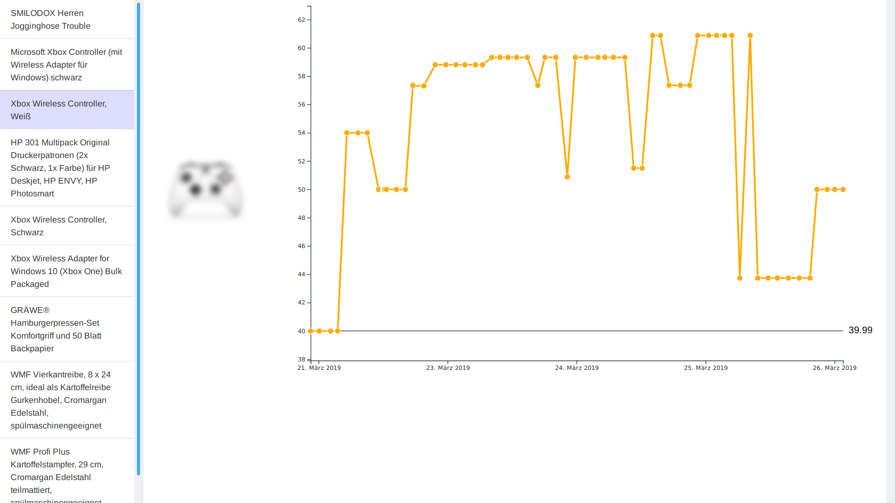

# Description

Just a small price logger to check when an item on Amazon is cheap. Because apparently, prices on Amazon change almost daily.

Could be used for other sites aswell.


Controller blurred for copyright reasons.

## Installation

### Logger

```shell
logger$ sudo apt install python3-lxml
logger$ sudo apt install libopenjp2-7-dev
logger$ sudo apt install libtiff5-dev
logger$ sudo pip3 install -r requirements
```

# Scripts

## Locally


### Visualization
```shell
visualization$ npm run build:dev
visualization$ npm start
```

## Deploy to production

### Visualization
```shell
visualization$ npm run build:prod
visualization$ npm run deploy:copy
visualization$ npm run deploy:install
```


# Config

## `logger/config.json`

```json
{
    "items": [
        {
            "id": "B073FGSC7T",
            "base_url": "https://www.amazon.de/dp/",
            "price_selector": "EUR \\d+,\\d\\d",
            "xpath_price": "//*[@id='priceblock_ourprice']",
            "xpath_title": "//span[@id='productTitle']",
            "xpath_img": "//img[@id='landingImage']/@data-a-dynamic-image",
            "threshold": 39
        },
        {
            "id": "B00008XX8F",
            "base_url": "https://www.amazon.de/dp/",
            "price_selector": "EUR \\d+,\\d\\d",
            "xpath_price": "//*[@id='priceblock_ourprice']",
            "xpath_title": "//span[@id='productTitle']",
            "xpath_img": "//img[@id='landingImage']/@data-a-dynamic-image",
            "threshold": 18.5
        },
    ],
    "poll": 7200,
    "poll_deviation": 1800,
    "check_timeout": 60,
    "mail": {
        "smtp_url": "smtp.gmail.com",
        "smtp_port": 465,
        "from": "your-address@gmail.com",
        "password": "gmail-password",
        "to": "alerts-going-to-this@e.mail"
    },
    "user_agents": [
        "Mozilla/...",
        "Mozilla/...",
    ]
}
```

# About

I'm [Sandr0x00](https://twitter.com/Sandr0x00). Check out my other repositories aswell.